# Tutorial 1: our first level

In this tutorial, we will recreate the 5th level of the campaign: **Vertigo**.

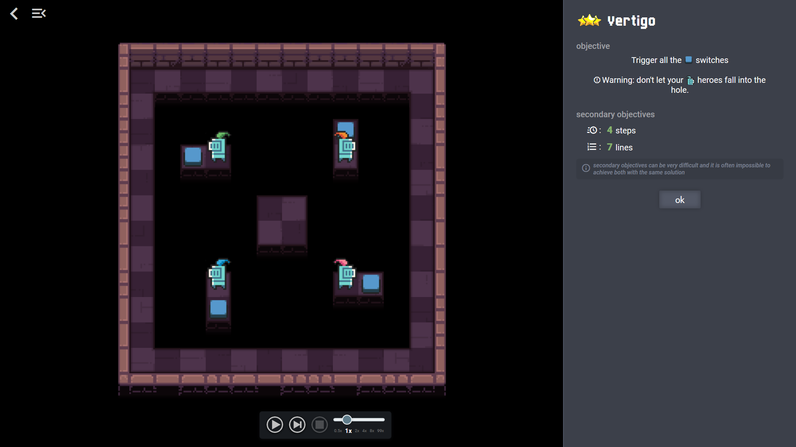

## Requirements

To follow this tutorial, you must have all necessary software installed as
described in the [installation guide](installation.md).

The main piece of software used for the creation of Selfless Heroes levels is
Tiled. Although it's not necessary to know Tiled to follow this tutorial, it
could be helpful to take a look at
[Tiled user manual](https://doc.mapeditor.org/en/stable/manual/introduction/).

## Setting up the project

Copy the folder `sh-leveleditor-dir/levels/tutorial1_start` to
`sh-leveleditor-dir/levels/vertigo`.

Note: `sh-leveleditor-dir/levels` is the working directory for level creation.
If you try to work in another directory, Tiled won't work properly.

At the end of this tutorial, `sh-leveleditor-dir/levels/vertigo` content should
match `sh-leveleditor-dir/levels/tutorial1_complete` content.

Content of `sh-leveleditor-dir/levels/vertigo`:

-   `map.json` describes the map of the level. We will open
    this file with Tiled.
-   `level.js` describes the rules of the level.
-   `metadata.json` contains some metadata about the level.
-   `tests.json` contains tests definitions for the level.
-   `rules.txt` is a file used internally by Tiled. :warning: Do not modify this
    file.

:warning: Do not rename any of these files. Selfless Heroes utilities expect
these exact file names in order to be able to generate a level.

## Creating the map

Open `map.json` with Tiled.

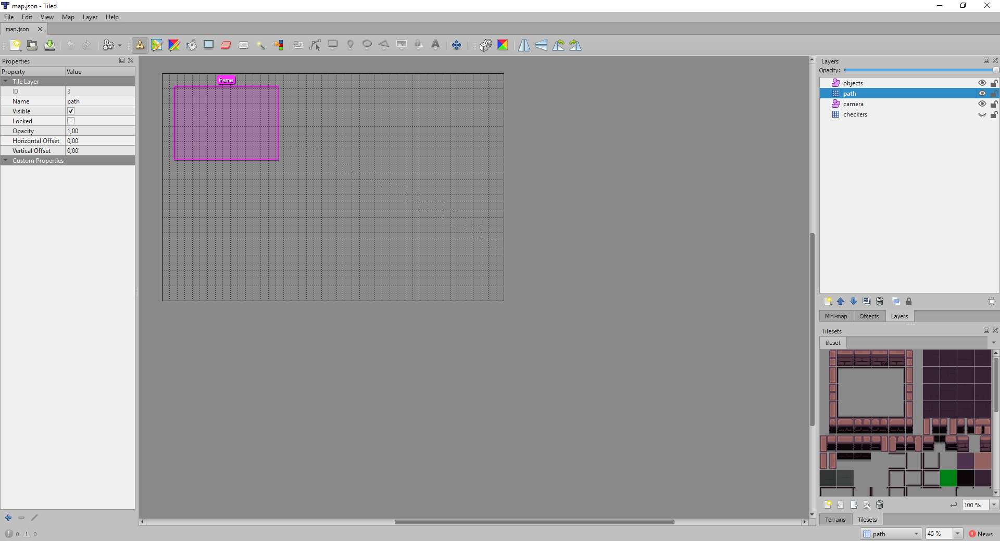

Make sure the right panel looks like this screenshot:

-   `Layers` tab is open with `path` layer selected within it.
-   `tileset` tab is open.

There are 4 layers already created:

-   `objects` layer contains all the level objects: heroes, switches, eggs,
    cauldrons etc.
-   `path` layer describes the raw information about the type of terrain whithin
    the map: where are the walls, holes, the floor etc.
-   `camera` layer contains information on how to display the level.
-   `checkers` layer is used by Tiled automapping feature. We will not modify
    this layer.

### Draw the map

Fortunately, we don't need to draw each tile manually. We will only have to draw
where is the floor, where are the holes and where are the walls and then the
automapping feature of Tiled will draw the final map automatically.

First, we need to draw the floor on the `path` layer. Select the floor tile from
the tileset by clicking on the square highlighted in the screenshot bellow.

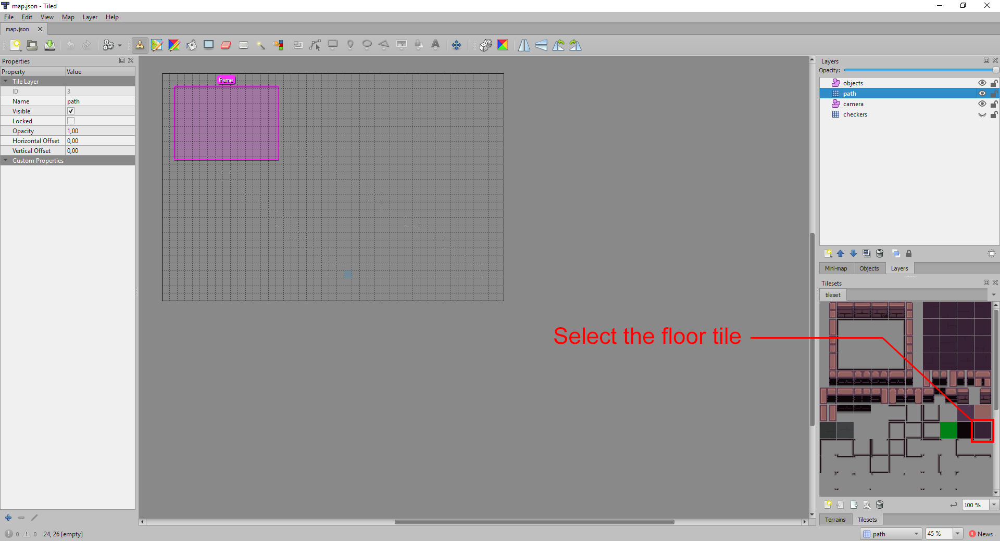

Now we can draw the floor of the map on the grid.

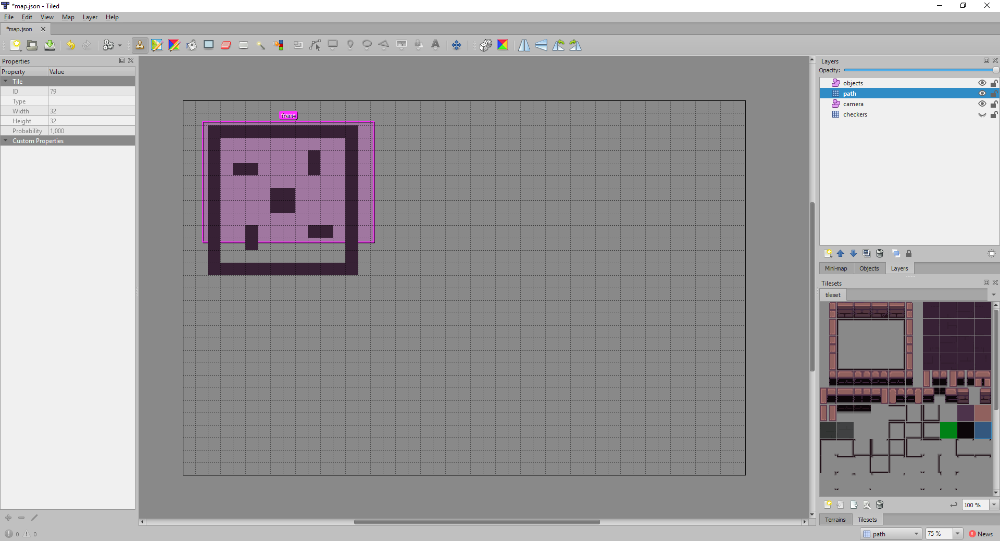

Now that we know the final dimensions of the map, we can resize the map to these
final dimensions. Go to the menu `Map` > `Resize Map...` and resize the map as
in the screenshot bellow and click `OK`.

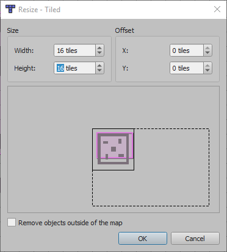

Note: we want to let a margin of 2 tiles around the edges of the map.

The automapping will assume that all tiles surrounding the floor are walls. So
we don't need to draw the walls, but we still need to draw the holes. To do so,
select the `hole` tile.

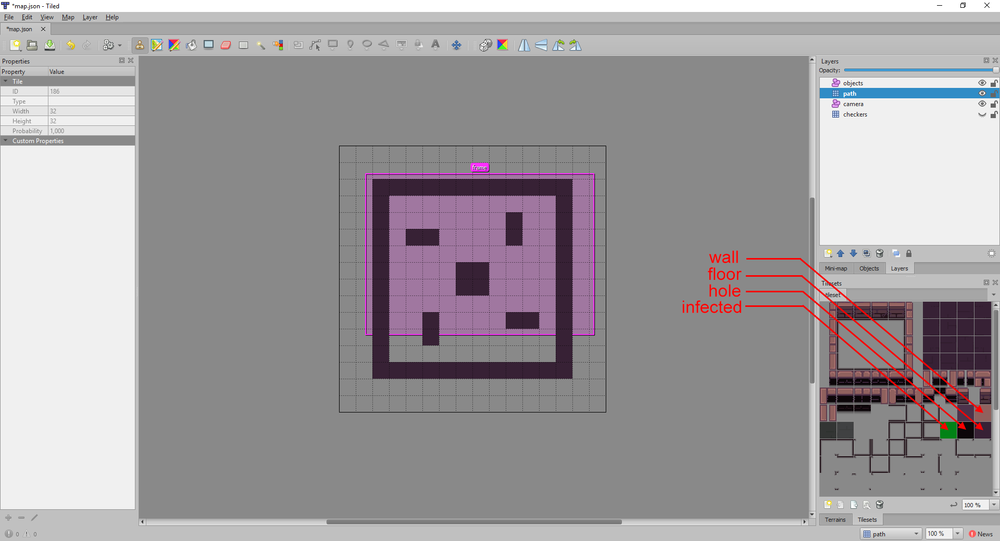

Draw around the floor where we don't want walls with the `hole` tile.

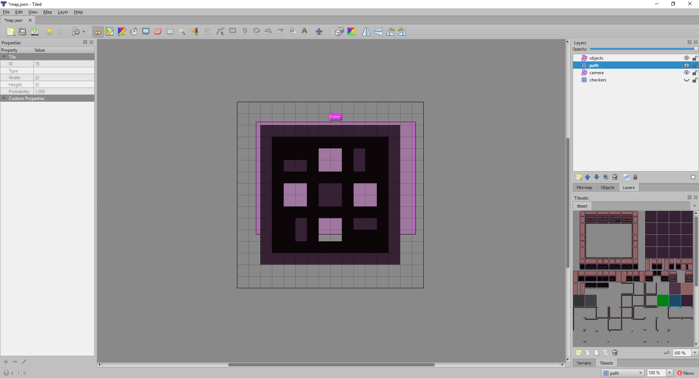

Now we are ready to use the automapping to generate our final map. :wink:

Go to the menu `Map` > `AutoMap`.

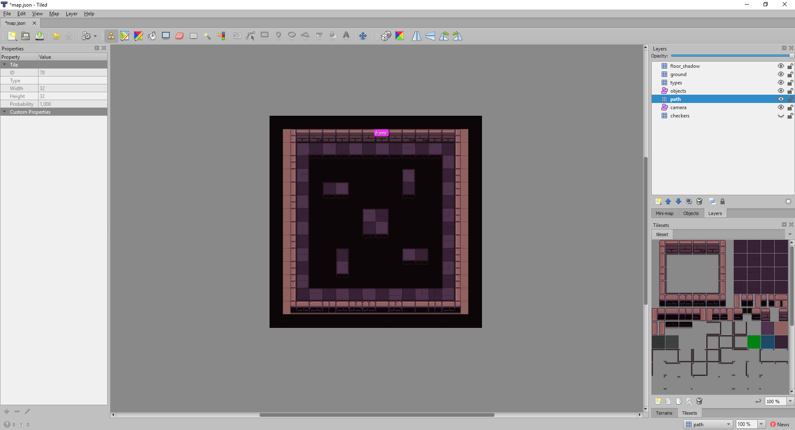

And here we are, the map has been autogenerated! :ok_hand:

Notice that 3 new layers were created automatically during the automapping
process:

-   `types` layer contains all terrain type information of the map. The game
    will determine the type of each square from this layer (floor, wall, hole...).
    It won't be displayed in the game.
-   `ground` layer is the main graphic layer that will be displayed in the game.
-   `floor_shadow` layer is a graphic layer which contains all the shadows. It
    will be displayed on top of the `ground` layer in the game.

Note: the automapping feature is not perfect. For more complicated maps, you may
have to edit some of these layers manually.

### Camera configuration

Now we have to setup the camera configuration so that the level is well
displayed in the game.

Select the `Objects` tab from the right panel, expand the `camera` layer and
select the `frame` object. You should see a highlighted rectangle on the map.
This rectangle defines the target of the camera in the game. Use the resize
arrows so that the rectangle contains the beige part of the outter walls.

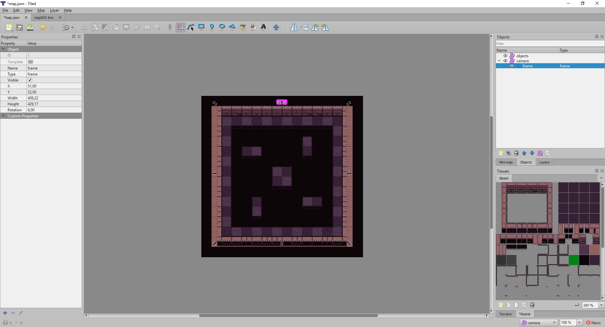

### Add objects

Now we will populate the map with objects. For this level, we need 4 heroes and
4 switches.

Select the `objects` layer from the `Objects` tab. Select the `Insert Point`
tool from the toolbar.

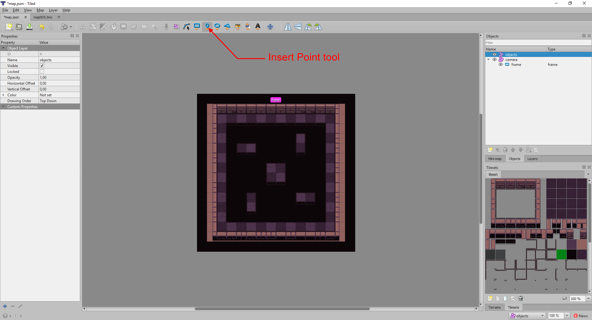

Click on the map in the place you want to create the first hero. It creates an
empty object in the right panel, we need to give it a hero type. Double click on
this object on the `Type` column and write "hero". You can also set a name to
this object if you want to, but it is not required.

Note: It doesn't matter where you click within a tile when creatig an object. You don't need to be precise, the important part is to choose a tile. :wink:

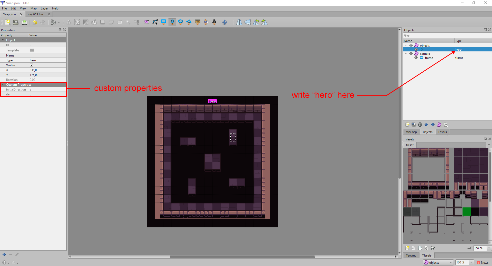

Notice that 2 custom properties have been added to the left panel:
`initialDirection` and `item`. These custom properties are defined in the
`objecttypes.xml` file that we imported into Tiled in the
[installation guide](intallation.md#import-selfless-heroes-object-types-in-tiled).

To create the other heroes, we can copy/paste this one in other locations of the
map. To copy the object, select the object from the right panel and press
<kbd>Ctrl</kbd>+<kbd>C</kbd>. To paste it in the desired location, just hover
your cursor on the desired location and press <kbd>Ctrl</kbd>+<kbd>V</kbd>.

Tip: to better see the created objects on the map, we can go back to the
`Layers` tab and move the `objects` layer all the way to the top. This way it
won't be hidden by `types`, `ground` and `floor_shadow` layers anymore.

Now create the 4 switches the same way we created the 4 heroes. Instead of
setting the type to "hero", their type must be set to "switch". In the end, you
should get something like that:

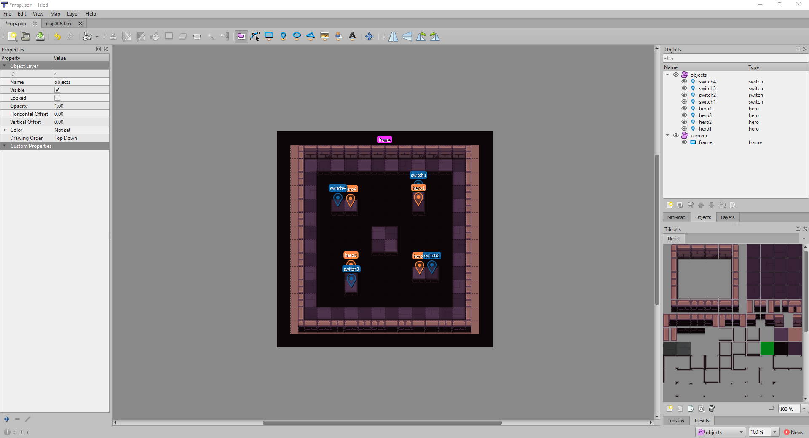

Save with <kbd>Ctrl</kbd>+<kbd>S</kbd> and the map is ready! :ok_hand:

## Keywords

Depending of your operating system or the version of the game you have installed
on your system, paths can vary. The following keywords will be used along the
tutorial to make things simple.

-   `sh-leveleditor-dir` refers to the path where you extracted
    `sh-leveleditor.zip`
-   `shutils` refers to the command line tool located in `sh-leveleditor-dir`
    -   _Windows_: `sh-leveleditor-dir\shutils.exe`
    -   _Linux_: `sh-leveleditor-dir/shutils`
-   `selflessheroes` refers to the game executable. This can vary a lot
    depending on your installation:
    -   _Windows_:
        -   _Steam_ version is generally:
            `C:\Program Files (x86)\Steam\steamapps\common\Selfless Heroes\Selfless Heroes.exe`
        -   _Windows Installer_ version:
            `C:\Program Files\Selfless Heroes\Selfless Heroes.exe`
    -   _Linux_:
        -   _Steam_ version is generally:
            `/home/{user}/.steam/SteamApps/common/Selfless Heroes/selflessheroes`
        -   _Snap_ version: `/snap/bin/selflessheroes`

## Packaging

The level needs to be packaged before we can open it in the game. We will use
the command line tools that comes with the level editor utilities to do so.

Open a terminal and get into `sh-leveleditor-dir`:

```shell
cd sh-leveleditor-dir
```

Package the level:

```shell
./shutils pack-level ./levels/vertigo
```

If everything go smoothly, this command creates the level file
`sh-leveleditor-dir/levels/vertigo/level.shlv` which can be open with the game.

## Open the level in the game

Open the level in the game with this command:

```shell
selflessheroes --dev ./levels/vertigo/level.shlv
```

Note: `--dev` option enables the game console. It will come in handy when we
come to troubleshooting custom levels.

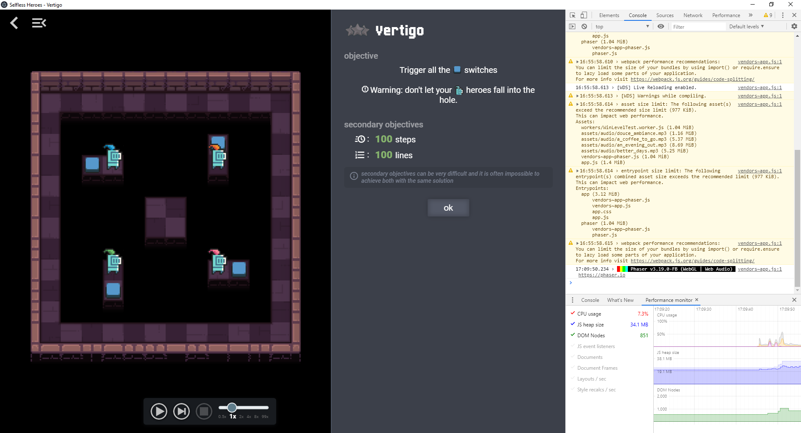

Alright! The level works as intended, but there is still some polish left to do.
:clap:

-   All heroes are facing east, it would be more beautiful if the heroes on the
    left were facing west.
-   I'm pretty sure this level is solvable in less than 100 steps and 100 lines.
    :laughing: We have to change the secondary objectives.

## Modifying the level

When working on a level, it's quite handy to use the `--watch` option of the
command line tool. It will watch the level files and try to repackage the level
as soon as a modification is detected. The level will be automatically reloaded
into the game.

Let's start the command line tool in watch mode:

```shell
./shutils pack-level ./levels/vertigo --watch
```

:bulb: See [`shutils` manual](shutils.md) for more details on the command line
tools.

### Change heroes orientation

Open `sh-leveleditor-dir/levels/vertigo/map.json` with Tiled. Select the heroes
on the left. In the `Custom Properties` panel located on the left of the editor,
set `initialDirection` to "w" (for west) and save. If you used the `--watch`
option, the level should be reloaded automatically into the game.

### Set secondary objectives

The secondary objectives are defined in
`sh-leveleditor-dir/levels/vertigo/level.js`. Open this file in a text editor.

This file defines pretty much all the properties of the level that are not
described by the map: the rules, the title, the objective text, the set of
instructions available, the secondary objectives etc. The next tutorial will be
focused on the creation of the `level.js` file. For now, we will only modify the
secondary objectives.

The secondary objectives are defined by `speedTarget` and `lengthTarget`
properties. This level is solvable in 4 steps and 7 lines so let's write this in
the file as secondary objectives.

```javascript
module.exports = {
  mapConfig: MAP_CONFIG,
  messages: {
    "en": {
      "name": "Vertigo",
      "objective": "Trigger all the %%icon icon-switch$%% switches\n\n%%icon mdi mdi-alert-octagon-outline$%%Warning: don't let your %%icon icon-hero$%% heroes fall into the hole."
    }
  },

  maxStep: 100,
  speedTarget: 4,
  lengthTarget: 7,
  deterministic: true,

  compilerConfig: {
    excludePrimary: ['assign', 'jump', 'clone'],
    terrainTypes: ['hole', 'floor'],
    objectTypes: ['switch', 'nothing'],
    actionFunctions: ['step'],
    leftComparisonExpressions: ['direction'],
    rightComparisonExpressions: ['object_type', 'terrain_type']
  },

  ruleset: {
    win: 'all_switches',
    lose: ['one_hero_dead', 'or', 'default_loss']
  }
}
```

## Conclusion

Congratulations! :sparkles: You just made your first Selfless Heroes level!
:smiley:

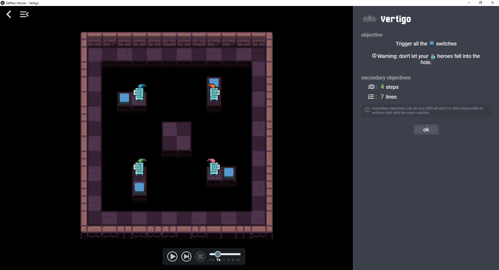

In the next tutorial, we will create a more intricate level, create custom
rules, create tests and publish it on Selfless Heroes API for review.

Next: [Tutorial 2: publish a complete level](tutorial2.md)
