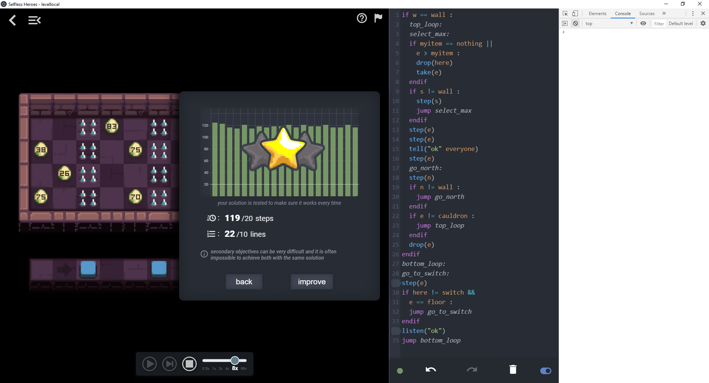
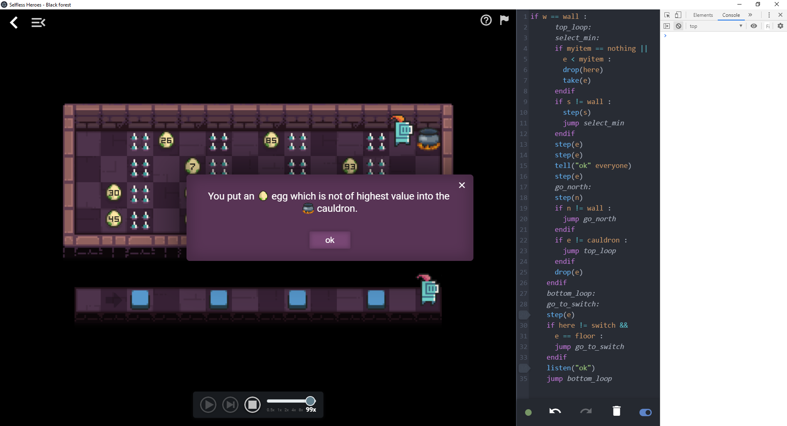

# Tutorial 2 - Part 5: Define the rules

In order to define the rules of the level, we will add a [Ruleset](Ruleset.md)
object to `level.js`. See [Ruleset documentation](Ruleset.md) for more details
on how to create rules for a level.

## Win condition

Create a [CustomWinCondition](Ruleset.md#customwincondition) that implements the
objective goal.

```javascript
module.exports = {

  // mapConfig: ...
  // messages: ...
  // worldGenerator: ...

  ruleset: {
    // CustomWinCondition object
    win: {

      // This method is called during the level initialization
      beforeStart(world) {
        // Find the highest value of all the eggs
        let max = 0
        for (let egg of world.eggs) {
          max = Math.max(max, egg.value)
        }

        // Create a 'maxValue' property on this CustomWinCondition object
        // for later use in check()
        this.maxValue = max
      },

      // This method is called after each step of the game loop
      // It should return true if the player has won, false otherwise
      check(world) {
        // Get the ids of the items in the cauldron
        const cauldronItems = world.cauldrons[0].items
        if (cauldronItems.length !== 1) {
          return false
        }

        // Find the egg with this specific id and check if its value is the highest
        const eggInCauldron = world.findObjectByID(cauldronItems[0])
        return eggInCauldron.value === this.maxValue
      }
    },

    lose: ['default_loss']
  }
}
```

:bulb: Check out the level [lifecycle](Level.md#life-cycle) to see when
`beforeStart()` and `check()` are called.

Open the level in the game and check that the win condition works with this
solution:

    if w == wall :
    	top_loop:
    	select_max:
    	if myitem == nothing ||
    	  e > myitem :
    		drop(here)
    		take(e)
    	endif
    	if s != wall :
    		step(s)
    		jump select_max
    	endif
    	step(e)
    	step(e)
    	tell("ok" everyone)
    	step(e)
    	go_north:
    	step(n)
    	if n != wall :
    		jump go_north
    	endif
    	if e != cauldron :
    		jump top_loop
    	endif
    	drop(e)
    endif
    bottom_loop:
    go_to_switch:
    step(e)
    if here != switch &&
      e == floor :
    	jump go_to_switch
    endif
    listen("ok")
    jump bottom_loop



It seams to be working fine. :+1:

## Loss conditions

For now, the loss conditions for the level are defined as
`lose: ['default_loss']`. It means that it uses the default loss conditions. You
lose if all the heroes die or if all the heroes are asleep or if the solution
takes too much time to complete the objective. These default loss conditions
make sense in most levels but we'd like to add some conditions in which the
player can lose.

See [LossConditions documentation](Ruleset.md#lossconditions) to better
understand how to create loss conditions for a level.

First we'd like the player to lose if only one hero dies.

```javascript
  lose: ['one_hero_dead', 'or', 'default_loss']
```

You can test that the new loss conditions work with this solution:

    if w == wall :
    	a:
    	step(e)
    	jump a
    endif

For now, when an egg which is not of highest value is dropped into the cauldron,
the player doesn't lose, it just keeps going. We'd like to rectify this by
creating a [CustomLossCondition](Ruleset.md#customlosscondition).

```javascript
lose: [{
    // Returns an identifier of this CustomLossCondition.
    // It is used in messages property to define
    // the message to display when this condition is triggered.
    getReason(world) {
      return 'loss_reason_wrong_egg_in_cauldron'
    },

    // This method is called during the level initialization
    beforeStart(world) {
      // Find the highest value of all the eggs
      let max = 0
      for (let egg of world.eggs) {
        max = Math.max(max, egg.value)
      }

      // Create a 'maxValue' property on this CustomWinCondition object
      // for later use in check()
      this.maxValue = max
    },

    // This method is called after each step of the game loop
    // It should return true if the player has lost, false otherwise
    check(world) {
      // Get the ids of the items in the cauldron
      const cauldronItems = world.cauldrons[0].items
      if (cauldronItems.length === 0) {
        return false
      }

      // If at least one egg in the cauldron is not of highest value
      // return true.
      const eggsInCauldron = cauldronItems.map(eggID => world.findObjectByID(eggID))
      return eggsInCauldron.some(egg => egg.value < this.maxValue)
    }
  },
  'or',
  'one_hero_dead',
  'or',
  'default_loss'
]
```

We have to add a custom message to the `messages` property that will be
displayed whenever this CustomLossCondition is triggered. We also add a warning
in the objective to inform the player about this loss condition.

```javascript
messages: {
  "en": {
    "name": "Black forest",
    "objective": "Put the %%icon icon-egg$%% egg of highest value into the %%icon icon-cauldron$%% cauldron.\n\n%%icon mdi mdi-alert-octagon-outline$%%Warning: don't put any other %%icon icon-egg$%% egg into the %%icon icon-cauldron$%% cauldron.",
    "loss_reason_wrong_egg_in_cauldron": "You put an %%icon icon-egg$%% egg which is not of highest value into the %%icon icon-cauldron$%% cauldron."
  },
  "fr": {
    "name": "Forêt noire",
    "objective": "Mets l'%%icon icon-egg$%% œuf de valeur maximale dans le %%icon icon-cauldron$%% chaudron.\n\n%%icon mdi mdi-alert-octagon-outline$%%Attention: ne mets pas d'autre %%icon icon-egg$%% œuf dans le %%icon icon-cauldron$%% chaudron.",
    "loss_reason_wrong_egg_in_cauldron": "Tu as mis un %%icon icon-egg$%% œuf qui n'est pas le maximum dans le %%icon icon-cauldron$%% chaudron."
  }
},
```

Let's test this CustomLossCondition in the game with the following code:

    if w == wall :
    	top_loop:
    	select_min:
    	if myitem == nothing ||
    		e < myitem :
    		drop(here)
    		take(e)
    	endif
    	if s != wall :
    		step(s)
    		jump select_min
    	endif
    	step(e)
    	step(e)
    	tell("ok" everyone)
    	step(e)
    	go_north:
    	step(n)
    	if n != wall :
    		jump go_north
    	endif
    	if e != cauldron :
    		jump top_loop
    	endif
    	drop(e)
    endif
    bottom_loop:
    go_to_switch:
    step(e)
    if here != switch &&
    	e == floor :
    	jump go_to_switch
    endif
    listen("ok")
    jump bottom_loop



Next: [:arrow_forward: Part 6: Configure Selfless Heroes language capabilities](tutorial2_6.md)
